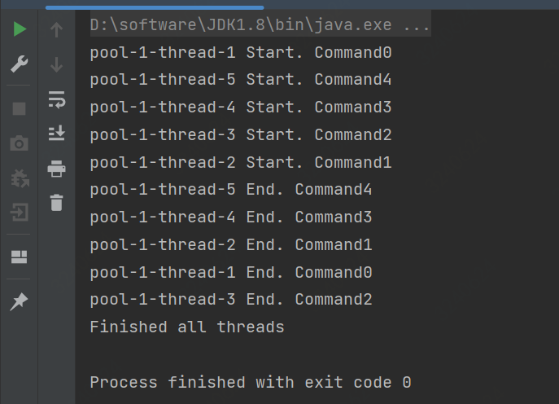
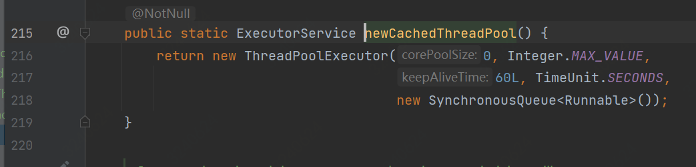

# 线程池
## 线程池
### 线程池
#### 线程池
## 概述
# java通过Executors工厂类创建四种线程池 
1. newCacheThreadPool:创建一个可缓存的线程池，若线程数超过处理所需，缓存一段时间后会回收，若线程数不够，则新建线程。因为初始线程池没有线程，而线程不足会不断新建线程。
~~~java
package com.zly.threadPool;

import java.util.concurrent.Executors;
import java.util.concurrent.ExecutorService;

/**
 * @author zhaoliyang9
 * @des newCacheThreadPool
 * @date 2023/8/14 13:26
 **/
public class NewCacheThreadPool {
    public static void main(String[] args) {
        ExecutorService cacheThreadPool = Executors.newCachedThreadPool();
        for(int i = 0; i < 5; i++){
            WorkerThread workerThread = new WorkerThread("" + i);
            cacheThreadPool.execute(workerThread);
        }
        cacheThreadPool.shutdown();
        while(!cacheThreadPool.isTerminated()){
        }
        System.out.println("Finished all threads");
    }
}
~~~
运行结果：

底层实现：

可缓存线程池没有核心线程，最大线程数为```Integer.MAX_VALUE```，即```2^31-1```，可缓存线程池中的线程全是非核心线程，其最大存活时间为```60s```，最大存活时间是指线程池中止之前等待任务的时间。
2. newFixedThreadPool:
3. newScheduledThreadPool:
4. newSingleThreadExecutor: